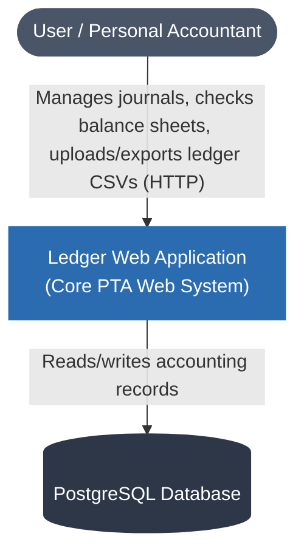
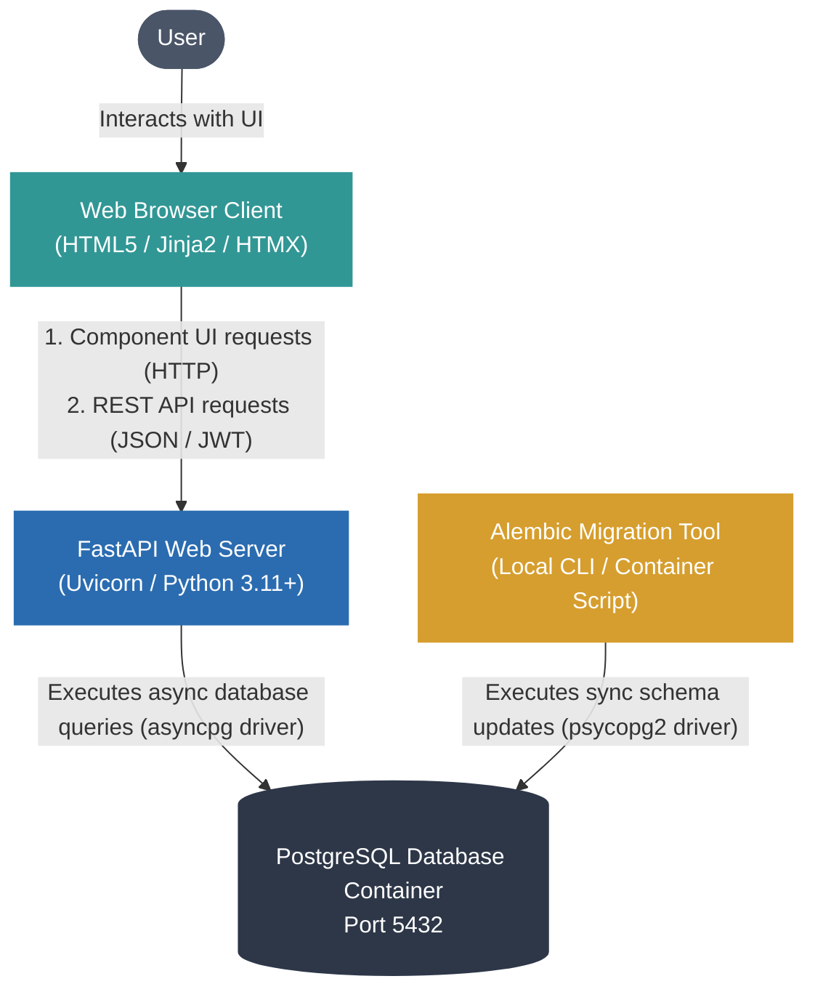
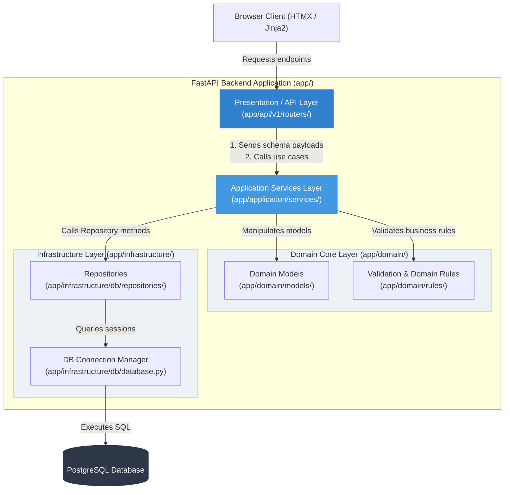

# Ledger Web Application - System Architecture Documentation

This document describes the high-level design and architectural boundaries of the Ledger Web Application using the **C4 Model** structure (Context, Container, and Component layers).

---

## Architecture Design Philosophy
Ledger Web is designed using a **Clean Architecture / Layered Pattern** to decouple the core business domain rules from external concerns such as databases, web frameworks, and templating systems.

The codebase is organized into four main directories under `app/`:
1. **Domain Layer (`app/domain/`)**: Pure business logic (e.g., transaction entries, accounts, double-entry rules) with no external dependencies.
2. **Application Layer (`app/application/`)**: Application services and use cases that coordinate business flows and invoke domain models.
3. **Infrastructure Layer (`app/infrastructure/`)**: External concerns such as the database setup, migrations, and repositories for CRUD operations.
4. **Presentation / API Layer (`app/api/` & `app/web/`)**: HTTP routing, request schemas (Pydantic), token validation, and web templates.

---

## 1. Level 1: System Context Diagram

The System Context diagram shows the high-level boundary of the Ledger Web Application system and how it interacts with external users and data persistent systems.

### Context Elements
* **User / Personal Accountant**: The individual or small business owner tracking personal finances, budgets, or investments.
* **Ledger System**: The main FastAPI application serving both the RESTful API endpoints and the Jinja2 + HTMX server-rendered front-end templates.
* **PostgreSQL Database**: Holds persistent relational data representing the ledger (users, journals, accounts, transactions, and budgets).

---

## 2. Level 2: Container Diagram

The Container diagram decomposes the system boundary into deployable containers (the web frontend client, backend api server, migration script runner, and database).

### Container Interactions
* **Web Browser Client**: Executes HTMX attributes to perform dynamic page swaps (avoiding full-page reloads) and handles authentication by storing JWT tokens locally.
* **FastAPI Web Server**: Serves application endpoints, provides dynamic templates, and validates request payloads via Pydantic. It utilizes async engine database connection pooling.
* **Alembic Migration Tool**: Coordinates migrations separately from the runtime container. It uses a synchronous psycopg2 driver to update PostgreSQL tables on startup or deployment.

---

## 3. Level 3: Component Diagram

The Component diagram shows the detailed code layers inside the **FastAPI Web Server** container and how they align with Clean Architecture practices.

### Component Details

#### 1. Presentation / API Layer (`app/api/v1/routers/` & `app/templates/`)
* **Purpose**: Exposes external REST API interfaces and Jinja2-rendered HTML pages.
* **Key Components**:
  - `auth.py`: Token authentication, registration, login endpoints.
  - `journals.py` & `transactions.py`: Entry/Journal creation and update routing.
  - `reports.py`: Retrieves cash flow, balance sheets, and ROI calculations.
  - `files.py`: Manages CSV uploads and ZIP backups.
  - `budgets.py` & `currencies.py`: Access routes to financial goals and settings.

#### 2. Application Services Layer (`app/application/services/`)
* **Purpose**: Coordinates application workflows (the use-cases) and separates presentation mapping from data storage logic.
* **Key Components**:
  - `transaction_service.py`: Computes transaction creation, balancing checks, and coordinates with repositories.
  - `report_service.py`: Orchestrates queries and transforms raw rows into ROI timelines or financial statement models.
  - `file_service.py`: Handles raw CSV parser algorithms, file storage, and data imports.

#### 3. Domain Core Layer (`app/domain/`)
* **Purpose**: Contains the core domain representations of plain-text accounting systems. This layer is entirely independent of web frameworks (FastAPI) and ORMs (SQLAlchemy), making it easy to test.
* **Key Components**:
  - `models/`: Represents structures like `Transaction`, `TransactionEntry`, `Journal`, and `Account` models.
  - `rules/double_entry.py`: Core PTA rule asserting that the sum of entry postings in a transaction must balance exactly to zero.
  - `rules/account_validation.py`: Normalizes and validates hierarchical account names (e.g. `assets:bank:checking`).

#### 4. Infrastructure Layer (`app/infrastructure/`)
* **Purpose**: Implement concrete interfaces to talk to filesystems, database connections, and libraries.
* **Key Components**:
  - `db/database.py`: Establishes async SQLAlchemy session factories (`postgresql+asyncpg` driver).
  - `db/repositories/`: Implements SQL queries using SQLAlchemy ORM (e.g. `transaction_repo.py`, `report_repo.py`).

---

## 4. Key Architectural Patterns

### 1. Unified Domain Types (High-Precision Math)
To prevent floating-point representation bugs in currency operations, Ledger Web enforces the use of Python `Decimal` data types throughout the schema validators, domain rules, and repository queries. The database tables map these fields to `Numeric(28, 10)`.

### 2. Performance Isolation (Sync vs Async Drivers)
* **Async Engine**: The runtime application queries use `postgresql+asyncpg` to release the event loop during I/O database operations.
* **Sync Engine**: Database migration operations run synchronously using `alembic` command execution and the synchronous `psycopg2` driver. This isolation ensures migration consistency without mixing async run loops in Alembic scripts.
